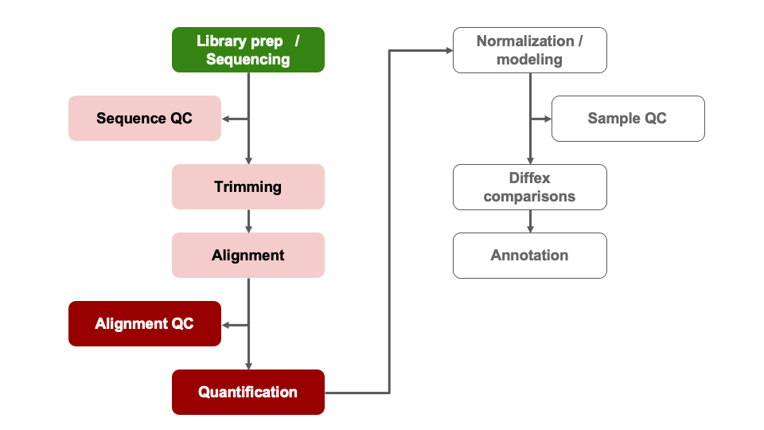
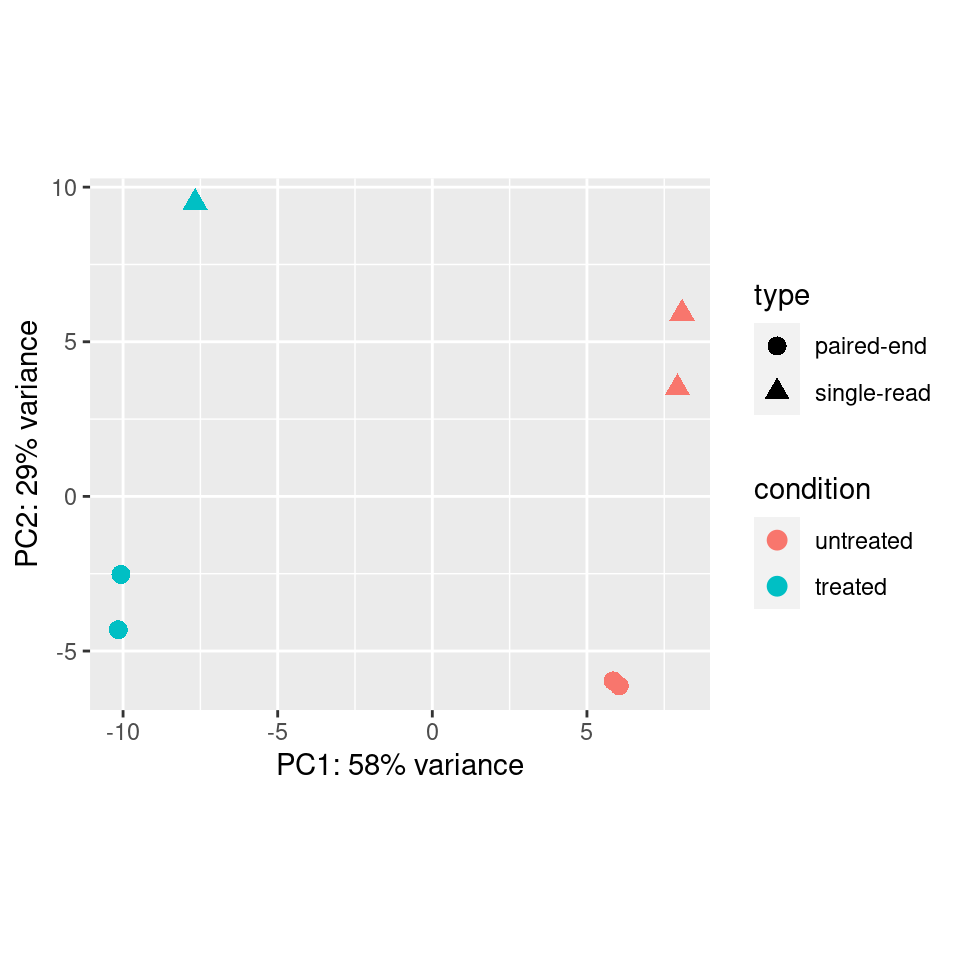

<style type="text/css">
body{ /* Normal  */
      font-size: 14pt;
  }
pre {
  font-size: 12pt
}
code.r{
  font-size: 12pt;
}
</style>

<!--- Allow the page to be wider --->
<style>
    body .main-container {
        max-width: 1200px;
    }
</style>

> # Objectives:     
> * Generate common QC visualizations   
> * Understand how to interpret QC visualizations    
> * Understand when to revise the model used in the DESeq2 initialization    
> * Understand the pitfalls of post-hoc analysis     
> * Describe the causes and implications of batch effect or other QC issues in an RNA-Seq experiment     


```{r Modules, eval=TRUE, echo=FALSE, message=FALSE, warning=FALSE}
library(DESeq2)
library(ggplot2)
library(tidyr)
library(dplyr)
library(matrixStats)
library(ggrepel)
library(pheatmap)
library(RColorBrewer)
load("rdata/RunningData.RData")
```


# Differential Expression Workflow

Prior to testing for differential expression between our comparisons of interest, we'll first generate plots that will assess how well our samples match up with our expectations (based on their treatment groups) and what we might expect to see from our differential expression comparisons.

{width=75%}

---

# Sample Visualizatons for Quality Control     

On Monday, we discussed aspects of quality control assessment at the sequencing data level. Today we will outline sample-level and gene-level quality control assessments to determine what we should expect for our differential expression comparisons.

To do this, we will first assess the similarity of our samples by using principal component analysis (PCA). This will allow us to determine how well patterns in the data fits our expectations from the experiments design and possible sources of variation.

Other common visualizations that we generate for our analyses include expression heatmaps, sample correlation heatmaps, and boxplots of raw and/or normalized counts, the code for which (due to time restrictions) can be found as bonus content through the materials for today and in the bonus content module.

## Principle Component Analysis (PCA) Plots

A common and very useful plot for evaluating how well our samples cluster by treatment groups are Principle Component Analysis (PCA) plots. PCA is used to emphasize variation and bring out patterns in large datasets by using dimensionality redution.

This image from
[a helpful step by step explaination of PCA](https://blog.bioturing.com/2018/06/14/principal-component-analysis-explained-simply/) helps to illustrate the principle component projections for two genes measured in approximately 60 mouse samples. Generally, this process is repeated and after each gene's contribution to a principle component or weight is determined, the expression and weight are summed across genes for each sample to calculate a value for each principle component.


>**Note**: A more detailed overview of the PCA procedure is outlined in [a Harvard Chan Bioinformatic Core training module](https://hbctraining.github.io/DGE_workshop/lessons/principal_component_analysis.html) and is based on a more thorough description presented in a [StatQuest’s video](https://www.youtube.com/watch?v=_UVHneBUBW0). Additionally, this [TowardsDataScience blog post](https://towardsdatascience.com/principal-component-analysis-3c39fbf5cb9d) goes through the math behind PCAs.

### Interpreting PCA plots

For most bulk RNA-seq experiments, we expect the majority of the total variance to be explained by the first two or three principle components.

{width=75%}

In this plot, which is similar to what we'll generate below for our data, where principle component 1 (PC1) explains ~80% of the variance in our data while principle component 2 (PC2) explains ~12% of the variance, which fits that expections.

*[Question]: How might we interpret the variance explained by each principle component in the context of the labeled sample points?*


For more information, this [helpful overview of PCA basics](https://blog.bioturing.com/2018/06/14/principal-component-analysis-explained-simply/) walks through both the generation and interpretation of PCA plots.    


### Evaluating batch effects or confounders

PCA plots are also useful for evaluating the impact of factors other than the experimental treatment or group.

At times, batch effects can be quite obvious, such as this example from the [DESeq2 vignette](http://bioconductor.org/packages/devel/bioc/vignettes/DESeq2/inst/doc/DESeq2.html), where samples within each treatment group look staggered into two subgroups.


If we color only by sequencing run type (paired-end vs. single-end), we see that PC2 (29% of variance) is primarily explained by this technical covariate.



However, the samples are clearly seperated by experimental condition on PC1 **and** since we have non-confounded batches, if we saw this pattern in our data we could incorporate the technical covariate into our model design, such as outlined in the [DESeq2 vignette](http://bioconductor.org/packages/devel/bioc/vignettes/DESeq2/inst/doc/DESeq2.html#multi-factor-designs).

<details>
    <summary>*Click for complex design discussion*</summary>
    In experiments with more complex designs, such as when there are interesecting/multiple treatment conditions, it can be less clear what covariants are influencing expression, such as illustrated from [this documenation for a microarray analysis tool](http://www.molmine.com/magma/global_analysis/batch_effect.html).
    From the PCA labeled by experimental treatment, we see that samples from the treatment group do not cluster together and that there is high variance across all treatment groups.
    
    However, when the plot is color coded by the technical batches of probe labeling, we see that the patterns in the data are better explained by batch than the experimental conditions.
    
</details>


## Plot Setup

We've already loaded the libraries we need for this module. We'll follow best practices and create new a subdirectory to organize our output figures, as well as a variable to store a descriptor of the dataset we are looking at so we can more easily recycle our plotting functions.

```{r Setupdirectory}
plotPath = './DE_outputs/figures/'
dir.create(plotPath, showWarnings = FALSE)
Comparison <- "Gtype.Tx" # descriptor for the dataset we are looking at
```

## PCA Plot initialization

Below, we will plot the rlog normalized data and generate the PCA projections for the top 500 using the `plotPCA` function from DESeq2, specifying `Gtype.Tx` as the condition of interest, and view the simple plot generated by the function.

```{r PCArlog3}
p.all <- plotPCA(rld, intgroup = c('Gtype.Tx'), ntop = 500)
p.all
```

We also see that samples in both `control` groups are fairly tightly grouped, while samples within each `Tx` group do not cluster as tightly. 

*[Question]: What can we take away from this PCA plot? Does it look like there are batch effects? Would we expect more DE genes for comparisons between ko.control and wt.control samples OR wt.Tx and ko.Tx samples?*

Next, we'll save this plot to file.
```{r PCArlog1}
pdf(file = paste0(plotPath, 'PCAplot_rlog_', Comparison, '.pdf'), onefile = TRUE)
p.all
dev.off()
```

**Checkpoint**: *If generated and saved the `p.all` PCA plot, please indicate with the green 'check' button. Otherwise, please use  use the red 'x' button in your zoom reaction panel to have this step repeated.*

## [Breakout Exercise 1] - Imagine a heatmap

It can be useful to visualize to visualize how our samples organize along with the expression pattern of individual genes. We will create a heatmap of the top most variable genes using the `pheatmap` function.

Before the exercise, let's look at the help page using the `?` symbol.
```{r pheatDoc, eval=FALSE}
?pheatmap
```

If we scroll down to the examples, we can test some of them out:
```{r testpheat}
# copied from the pheatmap documentation
test = matrix(rnorm(200), 20, 10)
test[1:10, seq(1, 10, 2)] = test[1:10, seq(1, 10, 2)] + 3
test[11:20, seq(2, 10, 2)] = test[11:20, seq(2, 10, 2)] + 2
test[15:20, seq(2, 10, 2)] = test[15:20, seq(2, 10, 2)] + 4
colnames(test) = paste("Test", 1:10, sep = "")
rownames(test) = paste("Gene", 1:20, sep = "")


pheatmap(test)
```

Now that we've gotten a sense of what `pheatmap` can generate, let' navigate to our first [breakout exercise](https://umich-brcf-bioinf.github.io/2022-03-14-umich-rnaseq-demystified/html/Module09a_breakout.html)
<br>
<br>

## Transferring our plot to our local computer

Rstudio server allows us to download files through the interactive file panel on the right side. If we navigate into the plot subfolder and select the `PCAplot_rlog_Gtype.Tx.pdf` or the  file, we can then click the blue gear symbol labeled `More` and select `Export...`. We should see a prompt regarding the name of the file and if we click `Download` the file should show up in your local "Downloads" folder.

### Optional - Scree Plot example 

<details>
    <summary>*Bonus: Click for example code for generating a ScreePlot*</summary>
     A screeplot is a way to visualize the variance explained by all principle components.
     To generate a scree plot, the PCA results need to be used independently of plotting, such as described by [this statquest post](https://statquest.org/pca-clearly-explained/) and replicated below.
```{r ScreePlot}
# generate PCA loadings
pca <- prcomp(t(assay(rld)), scale=TRUE)

## get the scree information
pca.var <- pca$sdev^2
scree <- pca.var/sum(pca.var)
p <- barplot((scree[1:10]*100), main="Scree Plot", xlab="Principal Component", ylab="Percent Variation")
print(p)
```
    We can see that the majority (~65%) of the variance across our samples is explained by the first three principle components, giving us some additional confidence regarding the quality of our data.
    In these scree plot examples from BioTuring, the plot on the left fits what we would expect for a dataset with high signal from the experimental treatment, where the majority of the variance is explained by the first few principle components. The plot on the right illustrates a scenario where the variance is distributed across many components, which could be due to low signal from the experimental treatment, complex experimental design, or confounding factors.
image: 
</details>


<br>

# Summary

In this section, we:    

* Discussed variance within treatment groups     
* Discussed technical artifacts, including batches
* Learned to generate PCA plots


---


# Sources Used    
* HBC QC tutorial: https://hbctraining.github.io/DGE_workshop/lessons/03_DGE_QC_analysis.html    
* Detailed Heatmap tutorial from Galaxy: https://training.galaxyproject.org/training-material/topics/transcriptomics/tutorials/rna-seq-viz-with-heatmap2/tutorial.html   
* PCA Overview: https://blog.bioturing.com/2018/06/14/principal-component-analysis-explained-simply/     


```{r WriteOut.RData, eval=FALSE, echo=FALSE, message=FALSE, warning=FALSE}
#Hidden code block to write out data for knitting
save.image(file = "rdata/RunningData.RData")
```


---


These materials have been adapted and extended from materials listed above. These are open access materials distributed under the terms of the [Creative Commons Attribution license (CC BY 4.0)](http://creativecommons.org/licenses/by/4.0/), which permits unrestricted use, distribution, and reproduction in any medium, provided the original author and source are credited.
