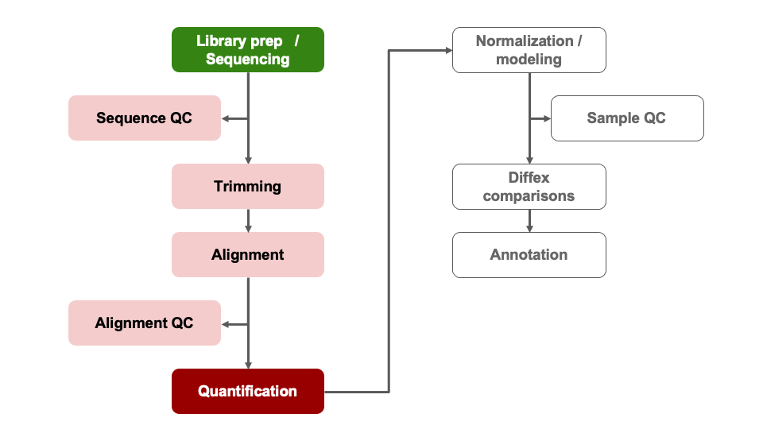

<style type="text/css">
body{ /* Normal  */
      font-size: 14pt;
  }
pre {
  font-size: 12pt
}
code.r{
  font-size: 12pt;
}
</style>

<!--- Allow the page to be wider --->
<style>
    body .main-container {
        max-width: 1200px;
    }
</style>
> # Objectives:    
> * Understand advantages of using gene ids when analyzing data.    
> * Given a list of ENSEMBL gene ids, add gene symbols and Entrez accessions.    
> * Generate common visualizations for differential expression comparisons    
> * Understand choosing thresholds for calling differentially expressed genes    
> * Discuss options for functional enrichments    

```{r Modules, eval=TRUE, echo=FALSE, message=FALSE, warning=FALSE}
library(DESeq2)
library(ggplot2)
library(tidyr)
library(dplyr)
library(ggrepel)
library(RColorBrewer)
load("rdata/RunningData.RData")
```

# Differential Expression Workflow

Here we will generate summary figures for our results and annotate our DE tables.

{width=75%}

**TODO: double check references to annotated table prior to running annotations**

---

# Visualizing DE results

Part of differential expression analysis is generating visualizations to share our results. While the DESeq2 tutorial provides [examples of other visualizations](http://bioconductor.org/packages/devel/bioc/vignettes/DESeq2/inst/doc/DESeq2.html#exploring-and-exporting-results), a common visualization to summarize DE comparisons are [volcano plots](http://resources.qiagenbioinformatics.com/manuals/clcgenomicsworkbench/752/index.php?manual=Volcano_plots_inspecting_result_statistical_analysis.html).

## Generating Volcano plots

As described by this [Galaxy project tutorial](https://galaxyproject.github.io/training-material/topics/transcriptomics/tutorials/rna-seq-viz-with-volcanoplot/tutorial.html), a volcano plot is a type of scatterplot that shows statistical significance (adjusted p-value) versus magnitude of change (fold change). In a volcano plot, the most upregulated genes are towards the right, the most downregulated genes are towards the left, and the most statistically significant genes are towards the top.

First, we need to set thresholds for determining significant genes. A reasonable threshold would be a fold-change of less than -1.5 or greater than 1.5 and an adjusted pvalue less than 0.05.
```{r PlotSetup1}
fc <- 1.5
pval <- 0.05
```

Then, we need to sep up some objects to run our plotting code, creating a new object that will have the right shape for plotting, labeling our comparison of interest, and setting up our output directory
```{r PlotSetup2}
df<- res_WT[order(res_WT$padj),] #select our data of interest
df <- as.data.frame(df) #convert our object type
df <- cbind("id" = row.names(df), df) #set rownames to valid column
str(df)

Comparison <- "ko.control_v_wt.control"

```

Once we've setup the annotations we need, we can proceed with generating the volcano plot, including our thresholds.
```{r VolcanoPlot, message=FALSE, warning=FALSE}
pdf(file = paste0(plotPath,'VolcanoPlot_', Comparison, '.pdf'), onefile = FALSE)
# Initialize the plot, saving as object 'p' and specifying the plot type as 'geom_point'

p <- ggplot(df, aes(x = log2FoldChange, y = -log10(padj))) +
    geom_point(shape = 21, colour= 'darkgrey', size = 1) +
    theme_classic() +
    xlab('Log2 fold-change') + ylab('-Log10 adjusted p-value')

# Add threshold lines
p <- p +
    geom_vline(
        xintercept = c(0, -log2(fc), log2(fc)),
        linetype = c(1, 2, 2)) +
    geom_hline(
        yintercept = -log10(pval),
        linetype = 2)

# Add Title that includes comparison name
p <- p + ggtitle(as.character(Comparison))

print(p)
dev.off()
p
```

<br>

<details>
    <summary>*Click for color coded volcano plot*</summary>
    Now we need to [subset our data](https://www.statmethods.net/management/subset.html) to label the datapoints (genes) that pass our thresholds.
```{r PlotSetup2a, message=FALSE, warning=FALSE}
df$dot <- rep(3, nrow(df))
df$dot[which(df$padj <= pval & df$log2FoldChange < 0 & abs(df$log2FoldChange) >= log2(fc))] = 2
df$dot[which(df$padj <= pval & df$log2FoldChange > 0 & abs(df$log2FoldChange) >= log2(fc))] = 1
df$sig <- df$dot

#take top 5 up, down, then combine, assign label
top <- rbind(head(subset(df, df$dot == 1), 5),head(subset(df, df$dot == 2), 5))
top$label <- top$id
df <- merge(x = df, y = top[,c('id','label')], by = "id", all.x = TRUE)

#count the number of significan up and down genes, assign value for legend
df$dot <- factor(df$dot,levels = c(1,2,3), labels = c(paste0('Up: ', sum(df$dot == 1)),paste0('Down: ', sum(df$dot == 2)),'NS'))
```

    Once we've setup the annotations we need, we can proceed with generating the volcano plot.

```{r VolcanoPlot2, message=FALSE, warning=FALSE}
pdf(file = paste0(plotPath,'VolcanoPlot_Fancier', Comparison, '.pdf'), onefile = FALSE)

p <- ggplot(df, aes(x = log2FoldChange, y = -log10(padj))) +
    geom_point(aes(color = df$dot), size = 1) +
    theme_classic() +
    xlab('Log2 fold-change') + ylab('-Log10 adjusted p-value')
# specify colors for up-/down-/nonsignificant genes
p <- p + scale_color_manual(name = '', values=c('#B31B21', '#1465AC', 'darkgray'))
# add threshol lines
p <- p +
    geom_vline(
        xintercept = c(0, -log2(fc), log2(fc)),
        linetype = c(1, 2, 2),
        color = c('black', 'black', 'black')) +
    geom_hline(
        yintercept = -log10(pval),
        linetype = 2,
        color = 'black')
# Add Title that includes comparison name
p <- p + ggtitle(as.character(Comparison))

print(p)
dev.off()
p
```

</details>

<br>

For additional visualizations for our DE results, we included some example code in the Bonus Content module and this [HBC tutorial](https://hbctraining.github.io/DGE_workshop/lessons/06_DGE_visualizing_results.html) includes some nice examples.

## Summarizing our DE results

To generate a general summary of the DE results, we can use the `summary` function to generate a basic summary by DESeq2.

However, we can also use conditional statements to determine the number of genes that pass our thresholds for each comparison, which might be more informative.

*[Question]: How would we identify the number of genes with adjusted p-values < 0.05 and a fold-change above 1.5 (or below -1.5)?*

```{r StatSigGenes2}
#summary(res_WT)
sum(res_WT$padj < 0.05 & abs(res_WT$log2FoldChange) >= log2(1.5), na.rm = TRUE)
sum(res_Tx$padj < 0.05 & abs(res_Tx$log2FoldChange) >= log2(1.5), na.rm = TRUE)
```
How do the number of DE genes compare to what we observed from the PCA plots?

#### Choosing thresholds

Thresholding on adjusted p-values < 0.05 is a standard threshold, but depending on the research question and/or how the results will be used, other thresholds might be reasonable. 

There is a nice [Biostart post that discusses choosing adjusted p-value thresholds](https://www.biostars.org/p/209118/), including cases where a more relaxed threshold might be appropriate and (some heated) discussion of the dangers of adjusting the choosen threshold after running an analysis. Additionally, there is a [Dalmon et al 2012](https://bmcbioinformatics.biomedcentral.com/articles/10.1186/1471-2105-13-S2-S11) paper about p-value and fold-change thresholds for microarray data that may help provide some context.


### Subsetting significant genes

It can be useful to annotate our results table with additional information to make them easier to interpret, such as adding additional gene information or better summarizing our DE results.


<details>
    <summary>*Click for code to generate a table of only DE genes*</summary>
    You may be interested in identifying only the genes that pass your significance thresholds. A useful way to do this is to conditionally subset your results.

    *Note: The tidyverse functions you learned in Software Carpentry could also be alternatively used here.*

```{r ConditionalSubset, eval=FALSE}
res_sig <- na.omit(res_WT)
res_sig <- res_sig[which(res_sig$padj < 0.05 & abs(res_sig$log2FoldChange) >= log2(1.5)), ]
head(res_sig)
```
    For more details about sub-setting tables in R, we recommend reviewing the [Data Carpentry manipulating and analyzing data module](https://datacarpentry.org/R-ecology-lesson/03-dplyr.html).
    We can also annotate our results to include a column that identifies our significant genes.
</details>

<br>

We can also add an annotation column to indicate if a gene passes the `padj` and `log2FoldChange` thresholds we set to call DE genes.
```{r ConditionalAnno, eval=FALSE}
res_WT_DE <- res_WT # copy table

# add a column and assign all genes are non-significance
res_WT_DE$Call <- rep(FALSE, length(res_WT$baseMean))

# change 'Call' column to TRUE if meets conditions for significant differences
res_WT_DE[which(!is.na(res_WT_DE$padj) & res_WT_DE$padj < 0.05 & abs(res_WT_DE$log2FoldChange) >= log2(1.5)), ]$Call <- TRUE

# reorder table to rank significant genes at the top
res_WT_DE <- res_WT_DE[order(-res_WT_DE$Call),]
head(res_WT_DE)
```


## Adding genome annotations

Since, gene symbols can change over time or be ambiguous we use and recommend using the EMSEMBL reference genome and ENSEMBL ids for alignmentsand we've been working with tables and data where all genes are labeled only by their long ENSEML ID. However, this can make it difficult to quickly look at results for genes of interest.

### Gene symbols versus Gene IDs

Luckily, Bioconductor provides many tools and resources to facilitate access to [genomic annotation resources](http://bioconductor.org/packages/devel/workflows/vignettes/annotation/inst/doc/Annotation_Resources.html).

To start, we will first load the [biomaRt library](https://bioconductor.org/packages/3.14/bioc/html/biomaRt.html) & choose what reference we want to access. For a more detailed walk through of using biomaRt, [this training module](https://bioinformatics-core-shared-training.github.io/cruk-summer-school-2019/RNAseq/html/05_Annotation_and_Visualisation.html) might be useful, including what to do when annotations are not 1:1 mappings.

## [Breakout Exercise 2] - Adding gene symbol annotations

First, we'll load the `biomaRt` library and then specify the dataset and biomart we want to use, where the values for `dataset` and `biomart` are based on the [biomaRt vignette on how to build a query](https://bioconductor.org/packages/release/bioc/vignettes/biomaRt) and the [biomaRt vignette on accessing ensembl](https://bioconductor.org/packages/3.14/bioc/vignettes/biomaRt/inst/doc/accessing_ensembl.html)

```{r Pullmart, warning=FALSE }
library("biomaRt")

ensembl <- useEnsembl(dataset = "mmusculus_gene_ensembl", biomart='ensembl')

```


*Note that this process takes some time and will take up a larger amount of working memory so proceed with caution if you try to run these commands on a laptop with less than 4G of memory*


To identify possible **filters** to restrict our data, we can use the `listFilters` function. To identify the **attributes** we want to retrive, we can use the `listAttributes` function. The best approach is to use [list or search functions](https://bioconductor.org/packages/release/bioc/vignettes/biomaRt/inst/doc/accessing_ensembl.html#how-to-build-a-biomart-query) to help narrow down the available options.
```{r AddAnnotations2, warning=FALSE, eval=FALSE}
head(listFilters(mart = ensembl), n = 20)
head(listAttributes(ensembl), n = 30)
```

We can access additional genomic annotations using the [`bioMart` package](https://bioconductor.org/packages/release/bioc/html/biomaRt.html). To identify  we'll structure our 'query' or search of the bioMart resources to use the [ENSEMBL id](https://m.ensembl.org/info/genome/genebuild/gene_names.html) from our alignment to add the gene symbols and gene description for each gene.

```{r AddAnotation3, warning=FALSE}
## wasn't working for my version of biomaRt but might work for you
GeneKey <- getBM(attributes=c('ensembl_gene_id', 'external_gene_name'),
      filters = 'ensembl_gene_id',
      values = row.names(assay(dds)),
      mart = ensembl) # will take some time to run

## check the key
head(GeneKey)
```


Now that we have the ENSEMBL information and a gene symbol to match to our results, we can procced to the [breakout exercise to annotate our DE table(s)](https://umich-brcf-bioinf.github.io/2022-03-14-umich-rnaseq-demystified/html/Module11a_breakout.html)


```{r checkAnnos}
head(res_WT_anno)
```
    Notice that not all genes were annotated with an ENSEMBl gene id or gene description. While we are able to annotate our results, we should be very cautious as the gene symbol is not a good unique identifier plus we did not use a UCSC annotation resource so the HUGO gene symbol may not always match. However, this code is similar to the steps needed to annotate ENSEMBL id based results, like what would have been generated from yesterday's alignments, with more interpretable gene symbols.


**Note**: For additional information regarding bioMart, please consult the [ENSEMBL bioMart vignette](https://bioconductor.org/packages/release/bioc/vignettes/biomaRt/inst/doc/accessing_ensembl.html) or the broader [Bioconductor Annotation Resources vignette ](http://bioconductor.org/packages/devel/workflows/vignettes/annotation/inst/doc/Annotation_Resources.html).

# Outputting results to file

A key aspect of our analysis is preserving the relevant datasets for both our records and for downstream applications, such as functional enrichments.

First, we'll setup a new directory for our output tables.
```{r OutputTableDir}
dir.create("tables", showWarnings = FALSE)
```

## DE results table

Next we'll write out our DE results for the KD comparison to file, since we added additional information to that table.
```{r DEResultsOuput}
write.csv(res_WT_anno,
          row.names = FALSE,
          na = ".",
          file="tables/DEResults_ko.control_v_wt.control_annotated.csv")
```

If we generated another comparision, we could repeat our annotations or write the DE results directly to file.

```{r DEResultsOuput2}
write.csv(res_Tx,
          row.names = FALSE,
          na = ".",
          file="tables/DEResults_ko.Tx_v_wt.Tx.csv")
```


## Count tables

The most relevant count tables are the raw, filtered count table that we used as the input for our analysis and the rlog normalized count table that we used for our quality control visualizations.


To output the raw counts, we will need to use the `counts` function to access the count table from within its larger `DESeqDataSet` object.
```{r OutputCountsRaw}
write.csv(counts(dds, normalized = FALSE), file="tables/DESeq2_raw_counts.csv")
```

Then we'll output the rlog count table, using the `assay` function to access the normalized count table from within its larger `DESeqDataSet` object.
```{r OutputCountsRlog}
write.csv(assay(rld), file="tables/DESeq2_rlogNormalized_counts.csv")
```


# Summary

In this section, we:   

* Generated a volcano plot for our differential expression results   
* Summarized our differential expression results    
* Discussed choosing thresholds    
* Annotated our tables of results to map gene IDs to gene symbols    
* Saved our results to file    


# Key takeaways

Overall, we've run through most of the building blocks needed to run a differential expression analysis and hopefully built up a better understanding of how differential expression comparisons work, particularly how experimental design can impact our results.  

What to consider moving forward:    

* How can I control for technical variation in my experimental design?      
* How much variation is expected with a treatment group?     
* What is my RNA quality, and how can that be optimized?    
* Are there quality concerns for my sequencing data?
* What comparisons are relevant to my biological question?    
* Are there covariates that should be considered?     
* What will a differential expression analysis tell me?


**Let's pause here for general questions**

---

# Extension - what can we do with our DE results?

Now that we have our DE results, have we address the biological question relevant to the authors of the [original paper](http://www.ncbi.nlm.nih.gov/pubmed/25464849)? On the one hand, yes - we now have two tables of genes that are impacted by change in Mov10 expression. But with two lists of genes alone, it can be difficult to find patterns or understand broader biological impacts.

What if we wanted to find out what genes were signifant in *both* comparisons? The `intersect` function, such as implimented as [part of the dplyr package](https://www.datasciencemadesimple.com/intersect-function-r-using-dplyr-intersection-data-frames/) would be useful to identify shared significant genes. A [venn diagram](https://www.r-graph-gallery.com/14-venn-diagramm.html) could be a way to visualize these overlaps.

A way to determine possible [broader biological interpretations](https://www.ebi.ac.uk/training-beta/online/courses/functional-genomics-ii-common-technologies-and-data-analysis-methods/biological-interpretation-of-gene-expression-data-2/) from the observed DE results, is functional enrichments. There are many options, such as some included in this [discussion thread](https://www.researchgate.net/post/How_can_I_analyze_a_set_of_DEGs_differentially_expressed_genes_to_obtain_information_from_them). Other common functional enrichments approaches are gene set enrichment analysis, aka [GSEA](http://software.broadinstitute.org/gsea/index.jsp), Database for Annotation, Visualization and Integrated Discovery, aka [DAVID](https://david.ncifcrf.gov/), [Ingenity](https://digitalinsights.qiagen.com/), and [iPathway Guide]

The University of Michigan has license and support for additional tools, such as Cytoscape, so we recommend reaching out to staff with [Taubman Library](https://www.lib.umich.edu/locations-and-hours/taubman-health-sciences-library/research-and-clinical-support) to learn more about resources that might be application toyour research.


---

# Sources Used      
* HBC DGE training module, part 1: https://hbctraining.github.io/DGE_workshop/lessons/04_DGE_DESeq2_analysis.html    
* HBC DGE training module, part 2: https://hbctraining.github.io/DGE_workshop/lessons/05_DGE_DESeq2_analysis2.html    
* DESeq2 vignette: http://bioconductor.org/packages/devel/bioc/vignettes/DESeq2/inst/doc/DESeq2.html#differential-expression-analysis    
* Bioconductor Genomic Annotation resources: http://bioconductor.org/packages/devel/workflows/vignettes/annotation/inst/doc/Annotation_Resources.html    
* BioMart vignette: https://bioconductor.org/packages/release/bioc/vignettes/biomaRt/inst/doc/accessing_ensembl.html    


```{r WriteOut.RData, eval=TRUE, echo=FALSE, message=FALSE, warning=FALSE}
#Hidden code block to write out data for knitting
save.image(file = "rdata/RunningData_Full.RData")
```

# Additional Resources
* MIDAS Reproduciblity Hub: https://midas.umich.edu/reproducibility-overview/
* ARC resources: https://arc-ts.umich.edu/
* Gene Set Enrichment Resources from Bioconductor: https://bioinformatics-core-shared-training.github.io/cruk-summer-school-2018/RNASeq2018/html/06_Gene_set_testing.nb.html
* Using HTSeq data with DESeq2: https://angus.readthedocs.io/en/2019/diff-ex-and-viz.html
* Detailed RNA-seq analysis paper: https://www.ncbi.nlm.nih.gov/pmc/articles/PMC6096346/
* Overview of RNA-seq analysis considerations: https://academic-oup-com.proxy.lib.umich.edu/bfg/article/14/2/130/257370
* Alternative overview of DESeq2, including visualizations and functional enrichments: http://dputhier.github.io/jgb71e-polytech-bioinfo-app/practical/rna-seq_R/rnaseq_diff_Snf2.html

---


# Session Info
```{r SessionInfo}
sessionInfo()
```

---

These materials have been adapted and extended from materials listed above. These are open access materials distributed under the terms of the [Creative Commons Attribution license (CC BY 4.0)](http://creativecommons.org/licenses/by/4.0/), which permits unrestricted use, distribution, and reproduction in any medium, provided the original author and source are credited.
